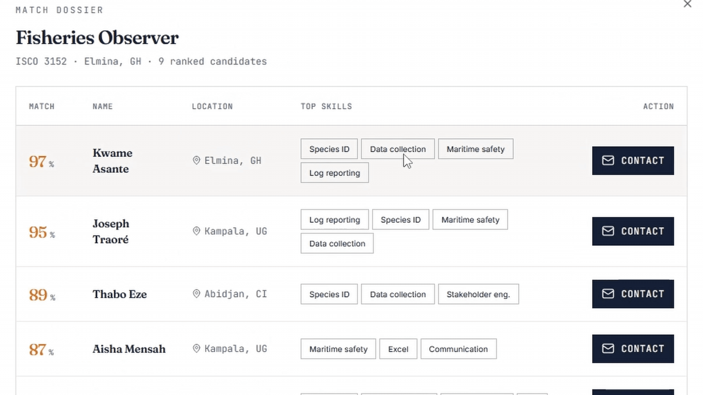

# UNMAPPED — CandidateConnect

A skills passport and labour market matching system for informal workers in low- and middle-income countries. Built on the ILO ESCO taxonomy and ILOSTAT employment data.

---

## What it does

Workers fill out a plain-language questionnaire. The system extracts and normalises their skills against the ESCO taxonomy, issues a portable JSON-LD skills passport, and matches it against real occupation and labour market data for Ghana, India, and Bangladesh.

Policymakers see a live market analysis dashboard — sector employment growth, earnings levels, and skill gaps — sourced from ILOSTAT.

---

## Quickstart

You need an OpenAI API key. The `data/` folder must contain `dashboard_simple_isco4.csv`.

**Terminal 1 — backend**

#### Bash
```bash
cp .env.example .env
# Set OPENAI_API_KEY in .env

cd backend
python -m venv .venv
source .venv/bin/activate
pip install -r requirements.txt

uvicorn skills_passport.main:app --reload
```

#### Powershell
```bash
cp .env.example .env
# Set OPENAI_API_KEY in .env

cd backend
python -m venv .venv
.\.venv\Scripts\activate
pip install -r requirements.txt

uvicorn skills_passport.main:app --reload
```

**Terminal 2 — frontend**

#### Bash
```bash
cd frontend
npm install
npm run dev
```

#### Powershell
```bash
cd frontend
npm install
npm run dev
```

Open `http://localhost:5173`. Backend API at `http://localhost:8000/docs`.

The first "Generate passport" submission takes ~5 s while the backend builds its embedding index. Every call after that is instant.

---

## Architecture

```
P1 Capture    Free-text questionnaire → ProfileInput
P2 Infer      OpenAI gpt-4o → structured skill extractions
P3 Mint       ESCO API lookup → JSON-LD SkillsPassport
P4 Match      OpenAI text-embedding-3-small → cosine search (426 ISCO-4 occupations)
P5 Annotate   Join with ILOSTAT employment + earnings signals
P6 Swap       Re-run match with a different country, same passport
```

Matching is in-memory numpy cosine similarity — no vector database required. The embedding index (426 × 1536 floats) is built once and cached to `backend/cache/`.

---

## Data sources

| Source | Role |
|---|---|
| ESCO taxonomy (European Commission) | Skill normalisation and occupation labels |
| ILOSTAT (ILO) | Employment growth, earnings levels by ISCO-4 |
| `dashboard_simple_isco4.csv` | Pre-joined ETL output — 1,704 rows, GHA / IND / BGD |

Countries covered: **Ghana** (2013–2017), **India** (2010–2024), **Bangladesh** (2013–2024).

---

## Endpoints

| Method | Path | Description |
|---|---|---|
| `POST` | `/passport/generate` | P1→P3: issue a JSON-LD skills passport |
| `POST` | `/match` | P4→P5: match passport to top-N occupations with signals |
| `GET` | `/market/{country_code}` | Sector employment aggregates for the market dashboard |
| `GET` | `/passport/health` | Liveness check |

---

## Environment variables

**Backend** (`backend/.env`):

| Variable | Required | Description |
|---|---|---|
| `OPENAI_API_KEY` | Yes | Used for skill extraction and embedding |
| `DASHBOARD_CSV_PATH` | No | Override default path to the ILOSTAT CSV |

**Frontend:** defaults to `http://localhost:8000`. Override by setting `VITE_API_BASE_URL` in a `frontend/.env` file.

---

## Project layout

```
talent-connect-hub/
  backend/
    skills_passport/
      main.py               # FastAPI app entry + CORS
      router.py             # all routes
      models.py             # Pydantic models + JSON-LD serialization
      consts.py             # constants
      country_pack.py       # GHA / IND / BGD packs
      normalizer.py         # P2 — OpenAI extraction
      passport_builder.py   # P3 — ESCO resolution
      dashboard_loader.py   # CSV index (lazy singleton)
      embedder.py           # P4 — OpenAI embedding wrapper
      indexer.py            # P4 — cosine index + disk cache
      matcher.py            # P4+P5 — match + signal annotation
    tests/                  # 79 unit tests, no network required
    .env.example
    requirements.txt
  frontend/
    src/
      lib/
        api.ts              # fetch wrappers
        types.ts            # shared TypeScript types
      components/
        EmployeesPanel.tsx  # form → passport → matches
        MarketAnalysisPanel.tsx
        EmployersPanel.tsx  # mocked
      pages/
        Index.tsx           # shared country selector
  data/
    dashboard_simple_isco4.csv
```

---

## Tests

```bash
cd backend
.venv/bin/pytest tests/ -v
```

79 unit tests. All OpenAI, ESCO, and file I/O calls are mocked — no API key or network required to run the suite.

---

## License

MIT — see `LICENSE`.
