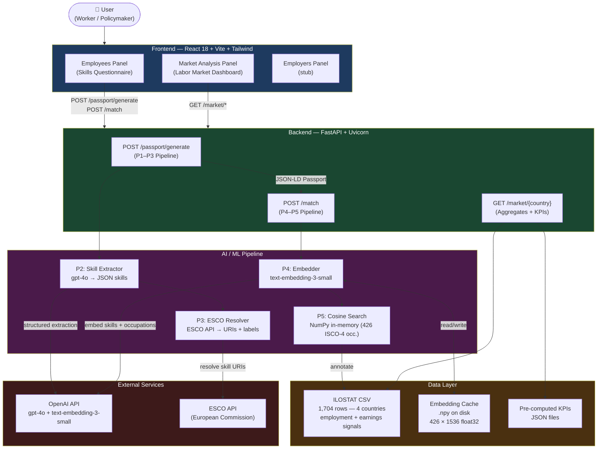

# Architecture Diagram

```mermaid
flowchart TD
    User(["👤 User\n(Worker / Policymaker)"])

    subgraph Frontend["Frontend — React 18 + Vite + Tailwind"]
        direction TB
        EmpPanel["Employees Panel\n(Skills Questionnaire)"]
        MktPanel["Market Analysis Panel\n(Labor Market Dashboard)"]
        EmpPanel2["Employers Panel\n(stub)"]
    end

    subgraph Backend["Backend — FastAPI + Uvicorn"]
        direction TB
        PassportRoute["POST /passport/generate\n(P1–P3 Pipeline)"]
        MatchRoute["POST /match\n(P4–P5 Pipeline)"]
        MarketRoute["GET /market/{country}\n(Aggregates + KPIs)"]
    end

    subgraph AIPipeline["AI / ML Pipeline"]
        direction TB
        Extractor["P2: Skill Extractor\ngpt-4o → JSON skills"]
        ESCO["P3: ESCO Resolver\nESCO API → URIs + labels"]
        Embedder["P4: Embedder\ntext-embedding-3-small"]
        Matcher["P5: Cosine Search\nNumPy in-memory (426 ISCO-4 occ.)"]
    end

    subgraph DataLayer["Data Layer"]
        direction TB
        CSV["ILOSTAT CSV\n1,704 rows — 4 countries\nemployment + earnings signals"]
        EmbCache["Embedding Cache\n.npy on disk\n426 × 1536 float32"]
        KPI["Pre-computed KPIs\nJSON files"]
    end

    subgraph ExternalAPIs["External Services"]
        OpenAI["OpenAI API\ngpt-4o + text-embedding-3-small"]
        ESCOApi["ESCO API\n(European Commission)"]
    end

    User --> Frontend
    EmpPanel -->|"POST /passport/generate\nPOST /match"| Backend
    MktPanel -->|"GET /market/*"| Backend

    PassportRoute --> Extractor
    Extractor --> ESCO
    PassportRoute --> |"JSON-LD Passport"| MatchRoute
    MatchRoute --> Embedder
    Embedder --> Matcher
    Matcher --> |"annotate"| CSV

    Extractor -->|"structured extraction"| OpenAI
    Embedder -->|"embed skills + occupations"| OpenAI
    ESCO -->|"resolve skill URIs"| ESCOApi

    Embedder <-->|"read/write"| EmbCache
    MarketRoute --> CSV
    MarketRoute --> KPI

    style Frontend fill:#1e3a5f,color:#fff
    style Backend fill:#1a4731,color:#fff
    style AIPipeline fill:#4a1a4a,color:#fff
    style DataLayer fill:#4a3010,color:#fff
    style ExternalAPIs fill:#3d1a1a,color:#fff
```
